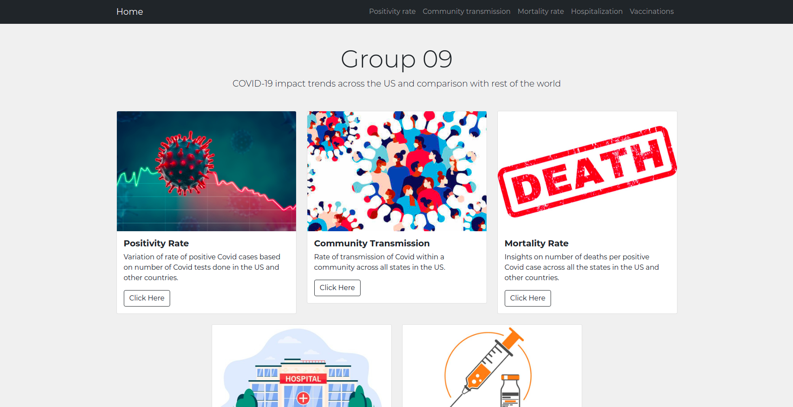
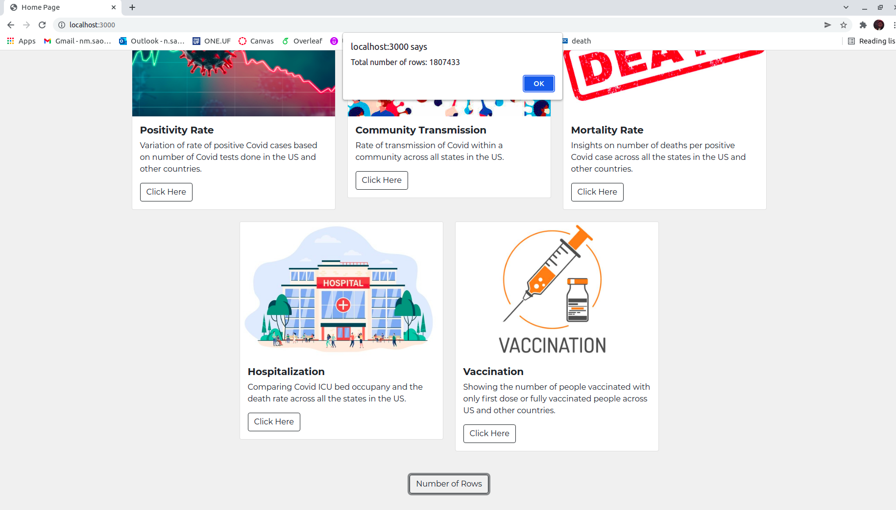
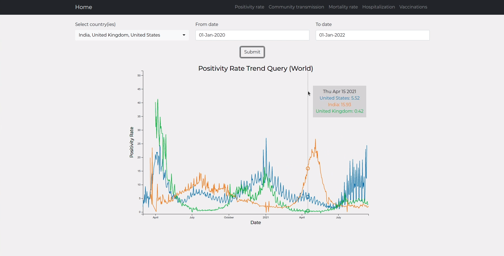
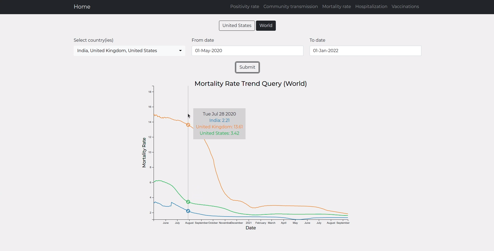
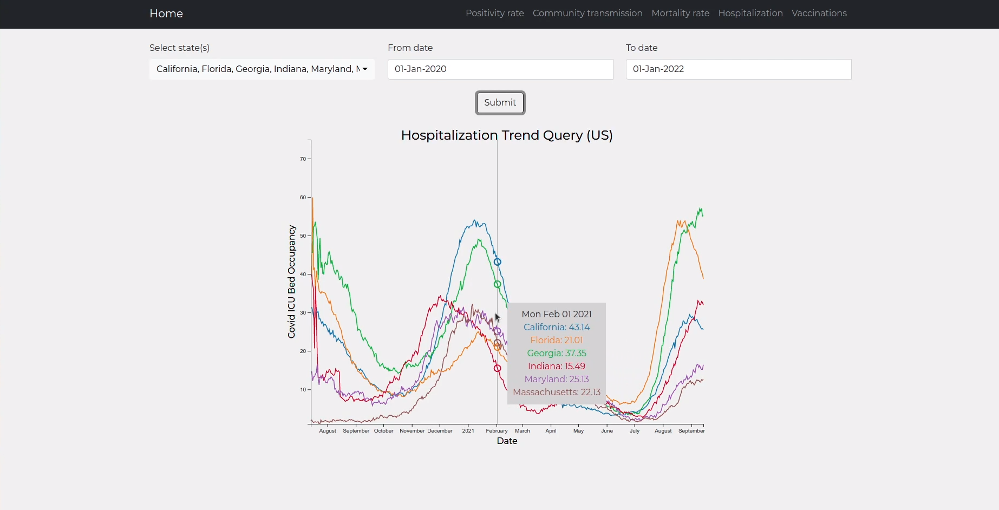
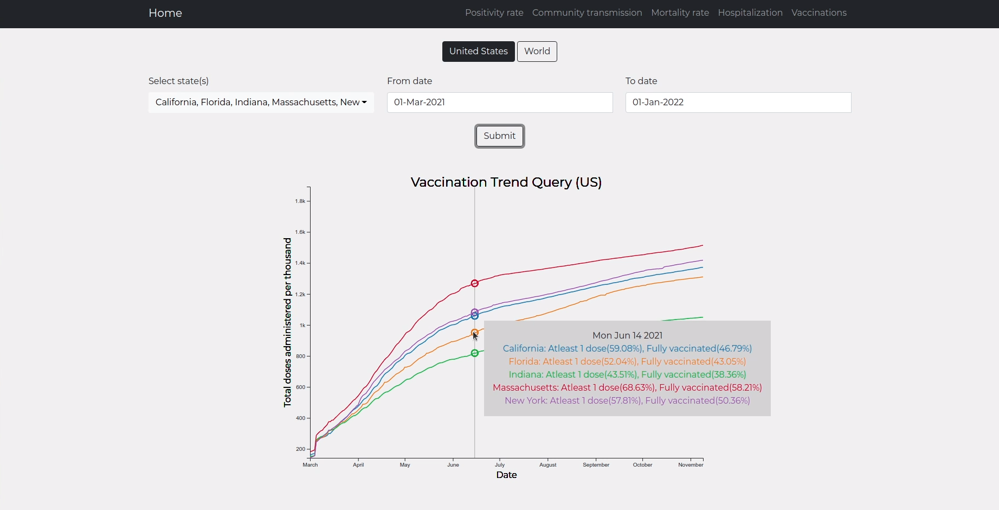
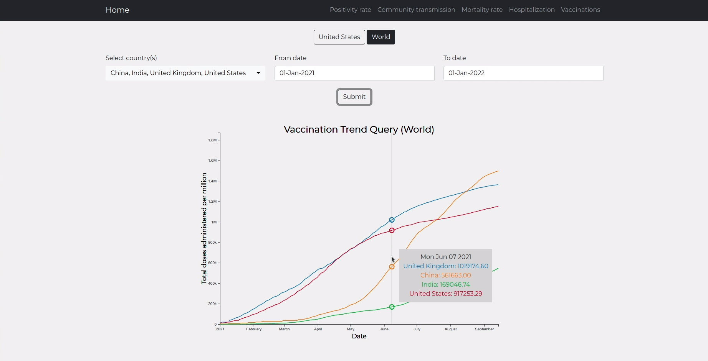

# cop5725-dbms-project

## Team Members (Group 09):
- Bodke, Gauri Pandharinath
- Gopinath, Ashwin
- Saoji, Nikhil Mukesh
- Viswanadha, Srinivas Nishant

## Steps to run the project:
- Go to the project directory and run `npm install` to install all the dependencies
- Run `npm start` to start the server
- Open `http://localhost:3000/` in the browser

## Web application:
### Homepage
Homepage consists of a navigation bar for easy access to the trend queries, 5 cards for 5 trend queries, and a button that sends an AJAX request to the backend to display the total number of rows in the oracle database used for this project. Our database consists of 7 tables, total of 1807433 rows, and is made by combining 4 publicly available datasets as mentioned below:
* COVID-19 Data Lake (https://registry.opendata.aws/aws-covid19-lake/)
* COVID-19 Reported Patient Impact and Hospital Capacity by State Timeseries (https://healthdata.gov/Hospital/COVID-19-Reported-Patient-Impact-and-Hospital-Capa/g62h-syeh)
* COVID-19 Vaccinations in the United States,Jurisdiction (https://data.cdc.gov/Vaccinations/COVID-19-Vaccinations-in-the-United-States-Jurisdi/unsk-b7fc)

### Positivity Rate
Positivity rate is defined by the ratio of total number of positive cases to the total number of tests done for that particular day.

### Community Transmission
For each state, it denotes the total number of counties in high transmission risk for each day. Out of the two indicators recommended by CDC, we are using the first indicator only to categorize a county in high transmission risk. For each day, it first calculates the total number of positive cases in the past 7 days. Now, using the population of that county, it finds news cases per 100000 person in the past 7 days. If that ratio is greater than or equal to 100, then that couny is considered as a high transmission risk county.

https://user-images.githubusercontent.com/89497585/152651589-f9d0b141-4eeb-4729-99b7-b1e17072a6d2.mp4

### Mortality Rate
Mortality rate is defined by the ratio of total number of COVID-19 deaths to the total number of positive COVID-19 cases.

#### United States

#### World

### Hospitalization
Hospitalization rate is defined by the ratio of ICU bed occupancy by COVID-19 patients to the total number of ICU beds.

### Vaccinations
Vacciations trend query represent the total number of vaccine doses given per thousand/million people. On hovering, it shows detailed analysis of percentage of people given at least one doses and fully vaccinated people.

#### United States

#### World

